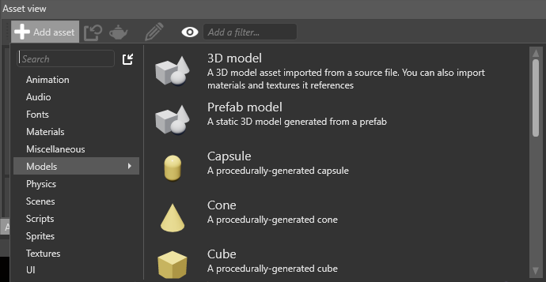
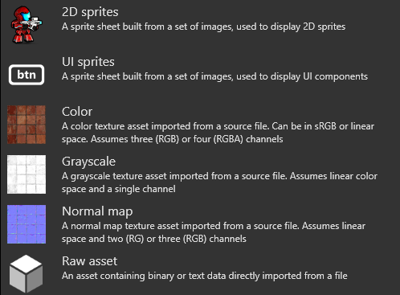

# Create assets

Beginner

There are two ways to create assets:

 * Use the **Add asset** button in the **Asset View**
 * Drag and drop **resource files** (such as image or audio files) to the **Asset view** tab
 
## Use the **Add asset** button

 1. In the *Asset View*, click 

 2. Select the type of asset you want to create.

	
 	
	Game Studio displays a list of asset templates. These are assets configured for a specific use.
	
 3. Select the right template for your asset.

    Game Studio adds the asset to the asset view:

	

> [!Note]
> Some assets, such as textures, require a resource file. When you add these assets, Game Studio prompts you for a resource file.

## Drag and drop resource files

You can drag compatible resource files directly into Game Studio to create assets from them. Game Studio is compatible with common file formats.

> [!NOTE]
> * You can't use this method to create assets that don't use resource files (eg prefabs, materials, or scenes).

| Asset type                    | Compatible resource file formats    
|-------------------------------|----------------------------------
| Models, animations, skeletons | .dae, .3ds, obj, .blend, .x, .md2, .md3, .dxf, .fbx 
| Sprites, textures, skyboxes   | .dds, .jpg, .jpeg, .png, .gif, .bmp, .tga, .psd, .tif, .tiff 
| Audio  	                 | .wav, .mp3, .ogg, .aac, .aiff, .flac, .m4a, .wma, .mpc 

To create an asset by dragging and dropping a resource file:

1. (Optional) If it isn't there already, move the resource file you want to use in the **Resources** folder of your project. You don't have to do this, but it's good practice to keep resource files organized and makes projects easier to share. For more information, see [Project structure](../files-and-folders/project-structure.md).

2. Drag the resource file from Explorer to the asset view:

	

3. Select the kind of asset you want to create:
   
	

	Game Studio adds the asset to the asset view:

	

Game Studio automatically imports all dependencies in the resource files and creates corresponding assets. For example, you can add a model or animation resource file and Game Studio handles everything else.

> [!TIP]
> You can drag multiple files simultaneously. If you drop multiple files of different types at the same time, Game Studio only adds only files that match your template selection. For example, if you add an image file and a sound file, then select the Sound asset template, only the sound file is added.

## See also

* [Manage assets](manage-assets.md)
* [Use assets](use-assets.md)