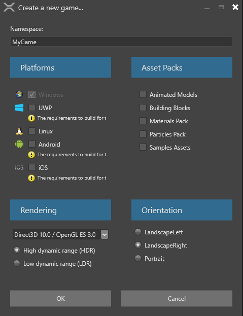
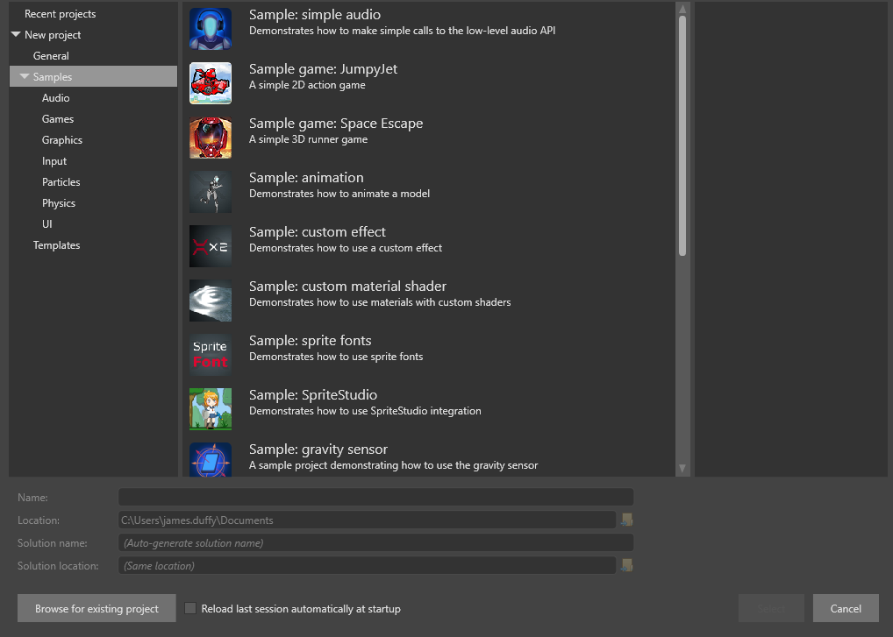
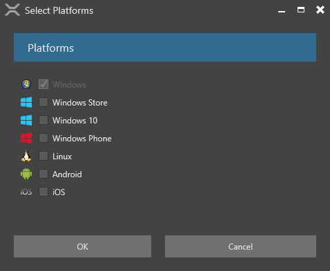

# Create a project

Beginner

This page explains how to:

* create a new empty project 
* create a project based on a template or sample 

**Templates** are projects that contain just the necessary elements to start working on a game.

**Samples** are complete games, which you can learn from or base a new game on.

## Create an empty project

An **empty project** is project that contains only the bare minimum to make a game: a simple scene with a light, camera, and script to move the camera, plus a preconfigured rendering pipeline. This is good when you want to start your game from scratch without elements you don't need. 

To create an empty project:

1. In the **Xenko Launcher**, click **Start** to start Game Studio. 

    The **New/open project** dialog opens.
    
    [New Project dialog](media/create-project-new-open-project-window.png)

    You can also open a new project in Game Studio from **File > New**. 
    
2. Select **New Game**.

3. In the **Name** and **Location** fields, specify a name for the project and the folder to save it in.

4. Click **Select**.

The **Create a new game** dialog opens.

5. In the **Namespace** field, specify the namespace you want to use. If you don't know what your namespace should be, leave it as default.

6. Under **Platforms**, select the platforms you want your game to support.  

    > [!Note]
    >  To support iOS and Android, you need to install <a href="https://www.xamarin.com/studio" target="_blank">Xamarin</a> (free if you have Visual Studio).

    If your development system is missing prerequisites for any of the platforms you select, Xenko displays a warning.

7. Under **Asset Packs**, you can select additional assets to include in your project. These include assets such as animations and materials. The asset packs are fun to play with when you're learning how to use Xenko, but they're not necessary.

8. Under **Rendering**, select the options you want.  
    
    **Graphics API:** The graphics features you can use in your project depend on the API you select. For advanced graphics features, select the latest version of the graphics APIs.
    
    >[!Warning]
    >Some graphics cards don't support the latest APIs. For some mobile devices, only DirectX 9.3 / OpenGL ES 2.0 and DirectX 10.0 / OpenGL ES 3.0 are available.

    **High or Low Dynamic Range (HDR / LDR):** This defines how color is computed in your project. In LDR mode, colors range from 0 to 1. In HDR mode colors can take any float value. HDR provides more advanced and realistic rendering but requires more processing power and profile DirectX 10.0 / OpenGL ES 3.0 or later.

9. Under **Orientation**, choose the orientation for your project. For PC games, use landscape. Portrait should usually only be used for mobile games.

10. Click **OK**.

Xenko creates the project and opens it in Game Studio. For more information, see [Game Studio](../game-studio/index.md).

## Create a project from a sample or template

Xenko includes several sample projects demonstrating each part of the engine (2D, 3D, sprites, fonts, UI, audio, input, etc). It also includes template games to help you make your own game. 
    
To create a project from a sample or template:

 1. Open the **New Project** dialog.
    
 2.	On the left, navigate to **New project > Samples**.
 
 2. **Select the sample** you want to create a project from. 
    
   

 3. Click **Select**.

    The **Select Platforms** window opens.

    
    	
 4. Select the platforms you want your game to support and click **OK**.

Xenko creates the project and opens it in Game Studio. 

## What's next?

* [Get familiar with Game Studio](../game-studio/index.md)