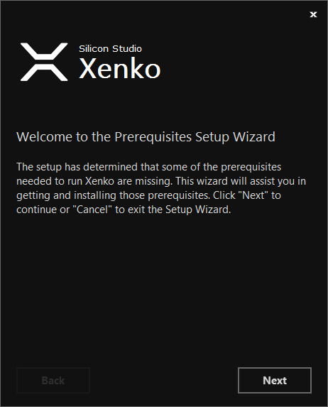
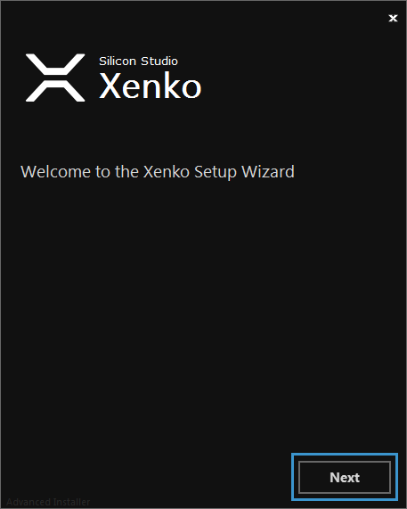
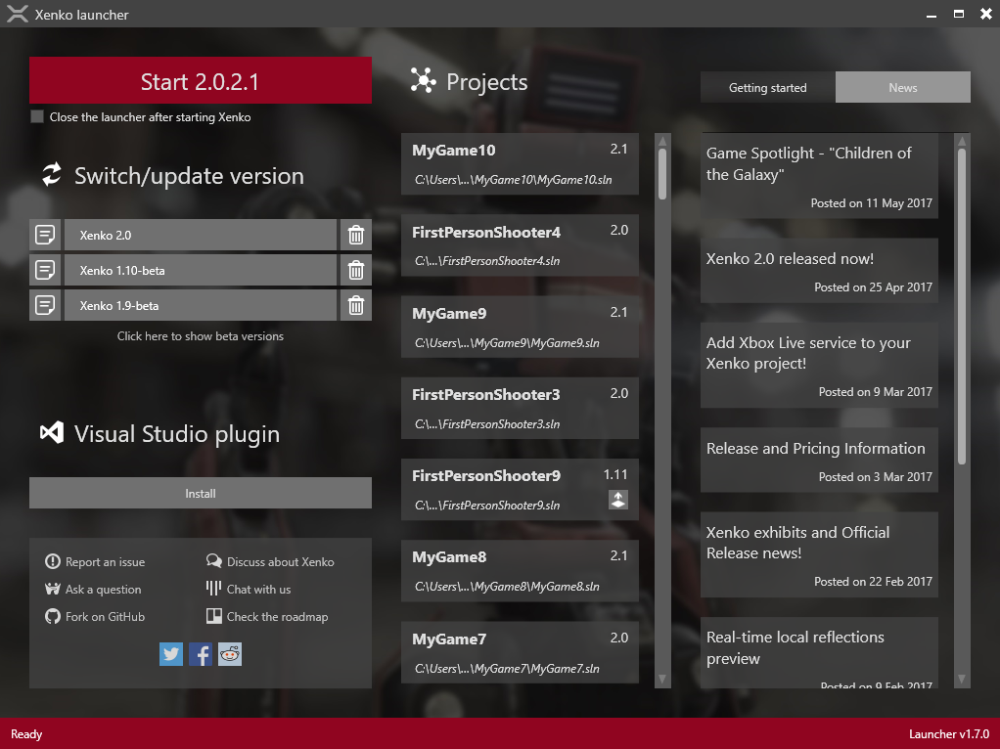
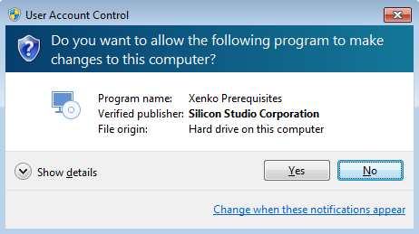
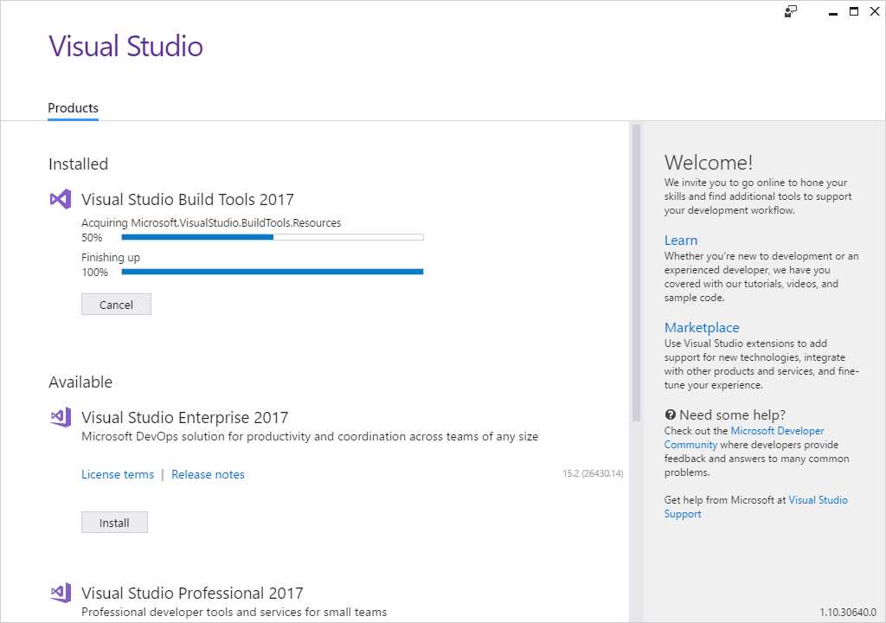

# Install Xenko

Beginner

1. Download the Xenko installer (**XenkoSetup.exe**) free from the [Xenko website](http://xenko.com/download/).
 
2. Double-click the **XenkoSetup.exe** file.
 
    The **Xenko Setup Wizard** opens.

3. Xenko requires .NET Framework 4.6.2. If you don't have this, Xenko prompts you to install it.

    

    Click **Next** and follow the prompts.

    > [!Note]
    > Alternatively, you can [download the .NET Framework from the Microsoft Download Center](https://www.microsoft.com/en-us/download/details.aspx?id=53345) and restart the Xenko installer.
	
4. The **Xenko Setup Wizard** opens.

     
 
     Click **Next**.
 
    The **Xenko License Agreement** window opens.

    

    Click **Accept**.
	
5. The **Xenko installation type** window opens.

    
	
    Select an installation type and click **Next**. 

6.  The **Select installation folder** window opens.

    

    Select a folder to install Xenko to and click **Next**.
	
7. The **Create application shortcuts** window opens.
    
    

    Choose which shortcuts you want Xenko to create, and click **Next**.
	
8. The **Ready to Install** window opens.
    
    

    Click **Install**.

9.  Installation begins.
 
    

    After the installer closes, Xenko creates shortcuts in locations you selected and the **Xenko Launcher** opens. 

    

    The Xenko Launcher prompts you to install the latest version of Xenko.

    

    Click **Yes**.

10. The Xenko Launcher asks if you want to install the Visual Studio integration. This lets you edit shaders directly from Visual Studio and provides syntax highlighting, live code analysis with validation, error-checking, and navigation. Installing the integration isn't mandatory, but we recommend it.

    

11. Windows confirms that Xenko can make changes to your computer.

    

    Click **Yes**.
    
12. Xenko checks if the prerequisites **Visual C++ Redistributable** and **Visual Studio Build Tools** are installed. If they're not installed, follow the prompts to install them.

    

    >[!Note]
    > Windows uses the Visual Studio installer to install the prerequisites, but it doesn't install Visual Studio.

    >[!Note]
    > If you don't install the prerequisites, Xenko won't run. In this case, you can install the prerequisites separately:
    
    > * [Download Visual C++ Redistributable](https://www.microsoft.com/en-us/download/details.aspx?id=48145)

    > * [Download Visual Studio Build Tools](http://landinghub.visualstudio.com/visual-cpp-build-tools)

    > Alternatively, uninstall Xenko, restart the Xenko installer, and install the prerequisites when prompted.

    Xenko is now installed and ready to use.

## What's next?

* [Launch Xenko](launch-xenko.md)