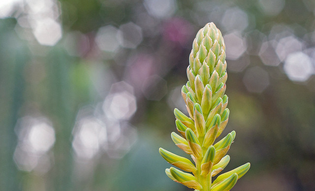
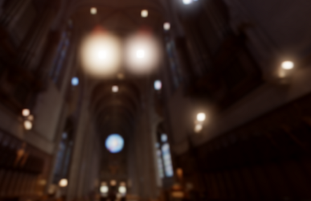
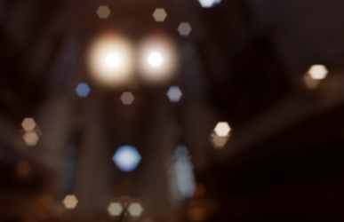

# Depth of field

Intermediate
Artist
Programmer

**Depth of field** effects simulate the behavior of a real camera lens focusing an object. 

By default, rendering produces a very sharp image, which can look artificial. In movies it's common to have the camera focus a specific object of the scene, leaving the background and foreground objects blurred and out of focus.

 

Xenko achieves the effect by creating several versions of the original image, with different intensities of blur and interpolate between them. The more layers used, the better the quality, but at some performance cost. 

 

## Properties

| Property   | Description     
| ---------- | -------- 
| Size       | Size of the [bokeh (Wikipedia)](https://en.wikipedia.org/wiki/Bokeh), expressed as a factor of the image width so it's resolution-independent. The bigger the size, the worse the performance                                              
| DOF Areas  | Areas of the depth of field. There are three main zones defined by their distance from the camera: near out-of-focus area (from X to Y), in-focus area (from Y to Z), and far out-of-focus area (from Z to W) 
| Technique  | The technique affects both the performance and the shape of the bokeh.   **Circular Gaussian** is fast but unrealistic.    **Hexagonal Triple Rhombi** is heavier than Gaussian.    **Hexagonal McIntosh** is the heaviest.     
| Auto Focus | Automatically updates the DOF areas so the camera focuses on the object at the center of the screen

## See also

* [Bloom](bloom.md)
* [Bright filter](bright-filter.md)
* [Color transforms](color-transforms/index.md)
* [Lens flare](lens-flare.md)
* [Light streaks](light-streaks.md)