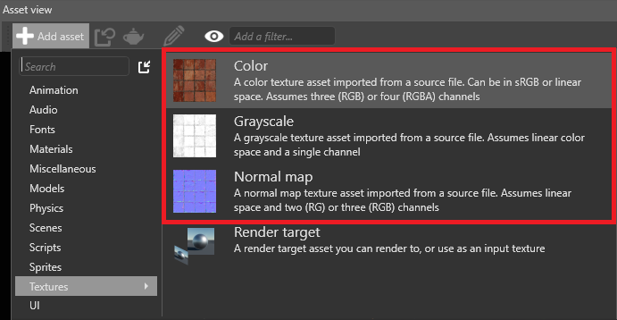
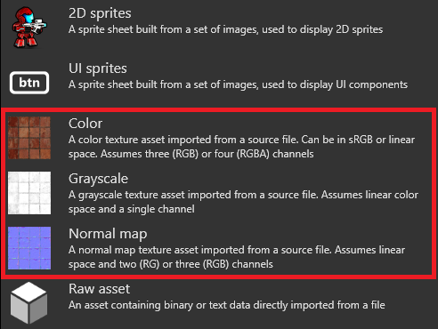
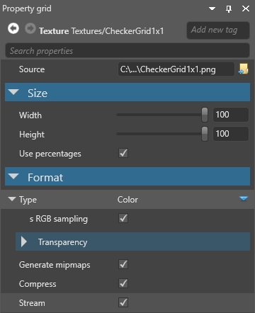
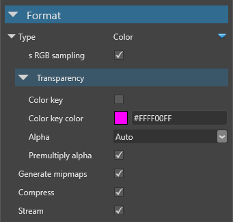

# Textures

Beginner
Artist
Programmer

**Textures** are images mainly used in [materials](../materials/index.md). Xenko maps textures to the surfaces the material covers.

Textures can add color information to a material — for example, to add a brick pattern to a wall or a wood pattern to a table. The values of the pixels in a texture (**texels**) can also be used for other calculations, such as in specular maps, metalness maps, or [normal maps](normal-maps.md). 

Materials typically contain multiple textures; for example, a material might contain a color texture, a normal map texture, and a roughness texture.

Textures can also be used outside materials; for example, you can draw them directly to the UI, or use them in [sprites](../../sprites/index.md).

## Supported file types

You can use the following file types as textures:

* `.dds`
* `.jpg`
* `.jpeg`
* `.png`
* `.gif`
* `.bmp`
* `.tga`
* `.psd`
* `.tif`
* `.tiff`

> [!Note]
> * Xenko only imports the first frame of animated image files, such as animated gifs or PNGs. They don't animate in Xenko; they appear as static images.
> * Xenko currently doesn't support movie files.

## Add a texture

In the **asset view**, click **Add asset** > **Texture**, then select a template for the texture (**color**, **grayscale** or **normal map**):

> [!Note]
> Render targets are a different kind of texture, and don't use images. Instead, they render the output from a [camera](../cameras.md). For more information, see [Render targets](../graphics-compositor/render-targets.md).

Alternatively, drag the texture file from Explorer to the asset view:

Then select a texture template (**color**, **grayscale** or **normal map**):
   

Game Studio adds the texture to the asset view:

## Texture properties

The following properties are common to all textures.

| Property         | Description
|------------------|---------
| Width            | The width of the texture as it's displayed in-game
| Height           | The height of the texture as it's displayed in-game
| Is size in percentage    | If selected, the width and height values are set to percentages. If cleared, they're set to percentages
| Width            | The width of the texture as it's displayed in-game
| Height           | The height of the texture as it's displayed in-game
| Type             | The texture type. Use **Color** for textures you want to display as images, **Normal map** for normal maps, and **Greyscale** to provide values for other things (eg specular maps, metalness maps, roughness maps). Color textures and mormal maps have additional properties (see below)
| Generate mipmaps | If selected, Xenko generates mipmaps for the texture
| Compress         | If selected, Xenko compresses the final texture to a format based on the target platform and use. The final texture must be a multiple of 4. For more information, see [Texture compression](compression.md)

### Color texture properties

The following properties apply if you set the texture **type** to **color**.

| Property | Description
|----------|---------
| sRGB sampling | If selected, the texture is stored in sRGB format and converted to linear space when sampled. We recommend you select this for all color textures, unless they're explicitly in linear space 
| Color key enabled | Use the color set in the **Color key color** property for transparency at runtime. If this isn't selected, the project uses transparent areas of the texture instead
| Color key color | The color used for transparency at runtime. This is only applied if **Color key enabled** is selected above
| Alpha | The texture alpha format (None, Mask, Explicit, Interpolated, or Auto)
| Premultiply alpha |  Premultiplies all color components of the images by their alpha component

### Normal map properties

The following property applies if you set the texture **type** to **normal map**.

| Property | Description
|----------|---------
| Invert Y | If selected, positive Y-component (green) face up in tangent space. This option depends on the tools you use to create normal maps

For more information about normal maps, see the [Normal maps](normal-maps.md) page.

## Grayscale textures

You can use grayscale textures to provide values in [material maps](../materials/material-maps.md). For example, you can use a texture as a **blend map** to blend two material layers:

Note how the blend map texture corresponds to the patterning on the result. 

For more information, see [Material maps](../materials/material-maps.md).

## See also

* [Normal maps](normal-maps.md)
* [Texture compression](compression.md)
* [Materials](../materials/index.md)
* [Sprites](../../sprites/index.md)
* [Render targets](../graphics-compositor/render-targets.md)