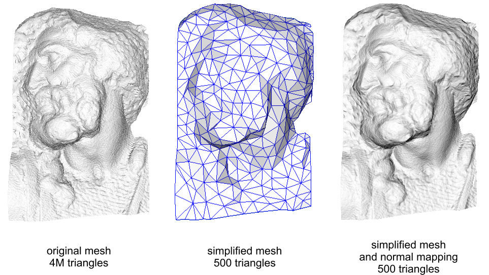

# Normal maps

**Normal maps** are textures that add the appearance of surface detail to materials.

These appear 

(Image courtesy of Paolo Cignoni, shared under [Attribution-ShareAlike 1.0 Generic (CC BY-SA 1.0)](https://creativecommons.org/licenses/by-sa/1.0/))

The left image shows a complex mesh of several million polygons. The right image shows a drastically simplified version of the same mesh, but with a normal map applied. The normal map contains information about how the mesh should reflect light, creating the illusion of much more complex geometry.

When used in combination with lighting they produce believable image which appears fully 3D even on a flat surface.

Normal maps usually represent small changes of the normal vector (the vector which points out of the surface). Xenko uses the most common convention: the X and Y components follow the tangent and the bitangent of the surface, and the Z component follows the normal vector of the surface. This means that a value of `(0, 0, 1)` coincides with the normal vector and represents no change, while a value of `(-1, 0, 0)` is tilts to the "left" (ie negative X value in the tangent (local) space).

## Add a normal map

## Properties

In addition to the [common texture properties](index.md), normal maps have two extra properties.

To use a texture as a normal map, make sure the  should be set to Normal Map. This makes sure the texture is assumed to be in linear color space and is converted to a format suited for normals.

Format

* Compressed - Xenko will compress your texture in the most appropriate format for each platform. This will enforce some settings on the material side (see below). The compressed image will be unsigned, even if your input format is signed.

* As is - Xenko imports the texture with the format you supply, as long as the target platform supports it.

## See also

* 

* ([Normal mapping (Wikipedia page](http://en.wikipedia.org/wiki/Normal_mapping))