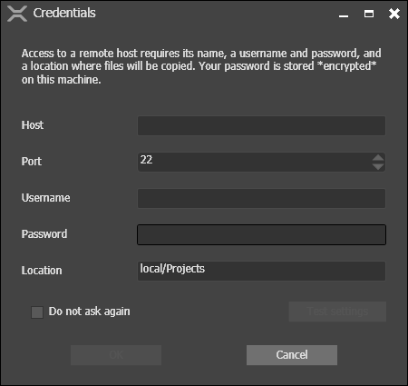
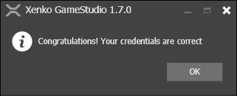

# Create a Linux game

>[!Note]
>Before following these instructions, make sure you've followed the instructions in [Linux - Setup and requirements](setup-and-requirements.md).

1. In the Xenko launcher, create a new game and select Linux as a target platform.

    

2. In Game Studio, in the platforms menu, select **Linux**.

    

3. Press **F5** to build and run the project.

4. The first time you run the project, enter information about your Linux host:

    

    Enter your information as below:

    

5. Click **Test settings** to test the credentials. 

    If you made an error, Game Studio displays:

    

    If the credentials are correct, Game Studio displays:

    

    Click the **OK** button to continue. 
    
    Game Studio copies the files over your Linux host in a subdirectory of the location you have provided. The name of the subdirectory is the name of your game.

    If something goes wrong, check the **Output** pane for details.

## Settings

Your credentials are saved in the **Settings** dialog:


The password is encrypted using the Micrsoft *System.Security.Cryptograph.ProtectedData.Protect* method for the current user, and saved in Base64, displayed in the Settings. You can't change the password from the Settings dialog.

There are two additional settings that control the execution of a game:

* Use CoreCLR: forces execution using .NET Core

* X Display: forces execution on a specific X display of your Linux host

## Compile outside Game Studio

Like any Xenko project, you can also compile the project directly from Visual Studio or from the command line. In both cases, you need to select a valid configuration:

* Debug
* Release
* CoreCLR_Debug
* CoreCLR_Release

Debug and Release target Mono. The others target .NET Core.

### Visual Studio

Once your project is loaded in Visual Studio, select the Linux project. In the **Solution Configurations** drop-down menu, you select a valid Linux configuration:


### MSBuild

To compile for Linux, from a command line, use:

```
msbuild /p:Platform=Linux /p:Configuration=CONFIG YourGame.sln
```

Where **CONFIG** is a valid Linux configuration.

## Limitations

* No debugging facility yet

* Switching the rendering graphics platform might cause the game to hang on startup. As a workaround, on the Linux host, in the directory where the game is deployed, delete the following directories: 

    * `cache`
    * `local`
    * `roaming`

## See also

* [Linux - Setup and requirements](setup-and-requirements.md)