# Display a UI in an overlay

This page explains how to render a UI to a texture, then display it as an overlay.

These instructions assume you already have a UI that you want to display in the overlay. For information about creating UIs, see the [UI](../ui/index.md) section.

> [!Note]
> You can't see overlays when you don't run your game in your VR device. This is because the VR device itself creates the overlay, not other hardware.

## 1. Create a render target texture

In the **asset view**, click **Add asset** and select **Texture** > **Render target**.

Game Studio adds a **render target** texture to your project assets.

In the following steps, we'll render the UI to this texture, then display it in the overlay.

## 2. Add a VR overlay

1. In the **asset view** (in the bottom pane by default), double-click the **Graphics Compositor** asset.

    

    The graphics compositor editor opens. For more information about the graphics compositor, see the [Graphics compositor](../graphics/graphics-compositor/index.md) page.

2. In the graphics compositor editor, select the **forward renderer** node.

    

3. In the **property grid** (on the right by default), expand **VR Settings**.

    

4. Next to **Overlays**, click  (**Add a new item to the list**).

    Game Studio adds a new overlay to the list.

    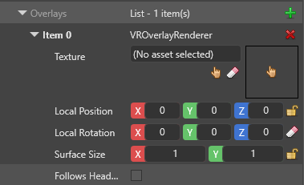

5. Next to **Texture**, click  (**Pick an asset up**).

    The **asset picker** opens.

    

6. Select the **render texture** you created and click **OK**.

## 3. Set up the UI render feature

1. In the graphics compositor editor, on the left, under **Render Features**, select the **UIRenderFeature**.

    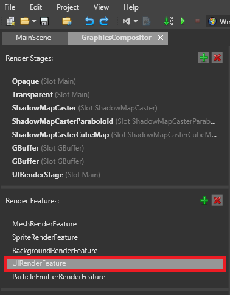

2. In the property grid, make sure **SimpleGroupToRenderStageSelector** is selected.

    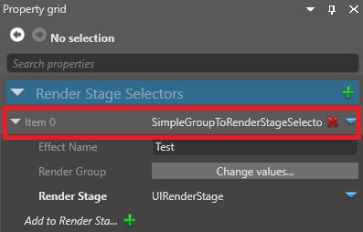

3. Under **Render Stage**, make sure **UIRenderStage** is selected.

    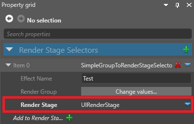

    This makes sure the UI is rendered in the UI render stage, which we'll use in the next step.

## 4. Set up the renderers

To display an overlay, you need at least two renderers:

* one to render your main camera
* one to render the UI to the overlay

This page describes the simplest way to do this from scratch, using two cameras and two renderers. Depending on your pipeline, you might need to create a different setup.

> [!Warning]
> These instructions involve deleting your existing renderers for the game entry point. You might want to make a backup of your project in case you want to restore your pipeline afterwards.

1. In the graphics compositor editor, select the **Entry points** node.

    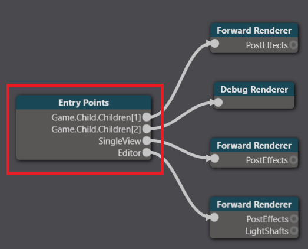

2. In the **property grid** on the right, next to **Game renderer**, click  (**Create an instance with the selected type**) and select **None** to delete your existing renderers.

    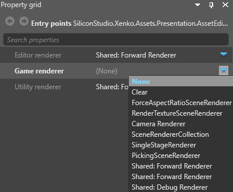

3. Next to **Game rendererer**, click  (**Create an instance with the selected type**) and select **Camera Renderer**.

    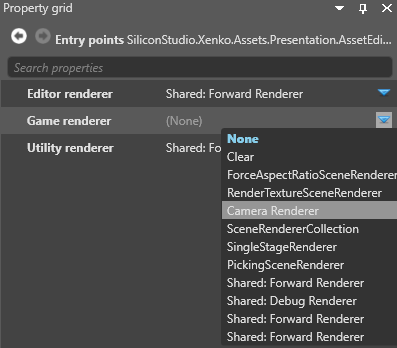

    Currently, **all** renderers must have a camera, or be a child of a renderer that has a camera. This applies even to renderers that don't necessarily use cameras, such as the single stage renderer, which renders the UI. 
    
    For this reason, in these instructions, we'll add a game renderer with a camera, then make the two renderers children of that renderer. This makes sure both renderers have a parent with a camera.

4. Next to **Camera**, click  (**Create an instance with the selected type**) and select your main game camera.

    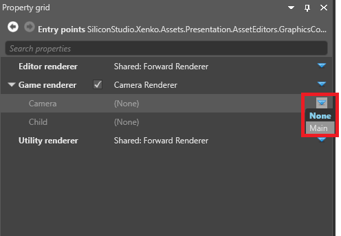

5. Next to **Child**, click  (**Create an instance with the selected type**) and select **SceneRendererCollection**.

    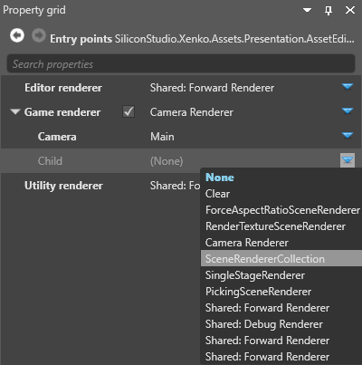

6. Next to **Children**, Click  (**Add a new item to the list**) and select **RenderTextureSceneRenderer**.

    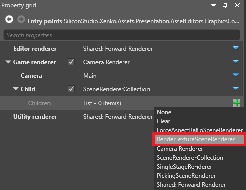

8. Next to **Child**, click  (**Create an instance with the selected type**) and select **SingleStageRenderer**. 

    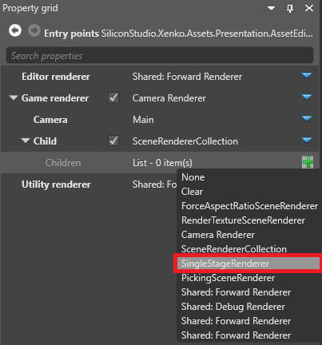

9. Next to **Render Stage**, click  (**Create an instance with the selected type**) and select **UIRenderStage**. This is the renderer that renders the UI.

    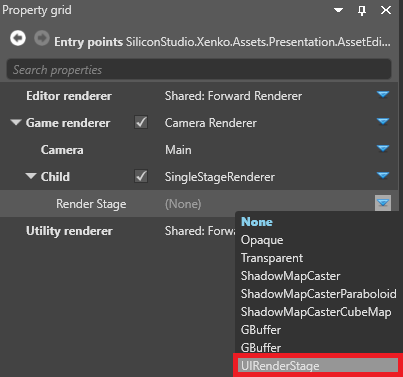

10. Next to **Render Texture**, click  (**Pick an asset up**).

    The **asset picker** opens.

11. Select the **render texture** and click **OK**.

    

    Game Studio adds the render texture to the renderer.

12. Under **Game renderer**, next to **Children**, click  (**Add a new item to the list**) and select **Forward renderer**.

    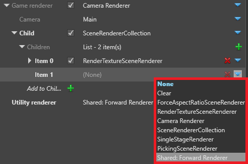

Your game is now ready to render the UI to an overlay in your VR device.

## VR template

For an example of a UI overlay implemented in a VR game, see the VR template included with Xenko.

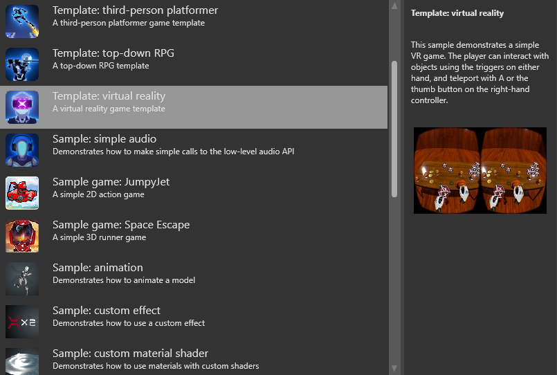

## See also

* [Overlays](overlays.md)
* [UI](../ui/index.md)
* [Render textures](../graphics/graphics-compositor/render-textures.md)
* [Graphics compositor](../graphics/graphics-compositor/index.md)
