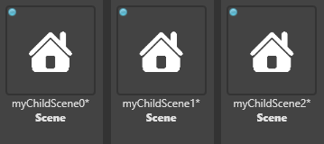
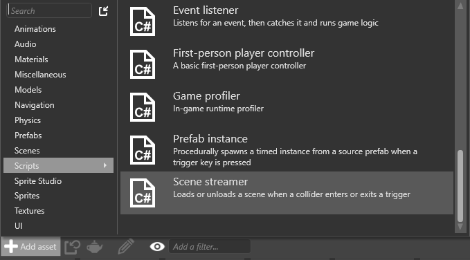
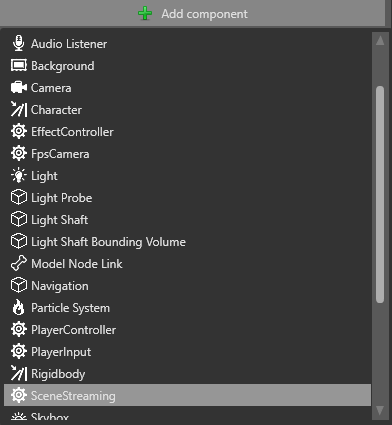

# Load and unload scenes at runtime

The following code loads three scenes and adds them as children:

```cs
var myChildScene0 = Content.Load<Scene>(url0);
var myChildScene1 = Content.Load<Scene>(url1);
var myChildScene2 = Content.Load<Scene>(url2);

myParentScene.Children.Add(myChildScene0);
myParentScene.Children.Add(myChildScene1);
myChildScene1.Add(myChildScene2);
```

>[!Note]
>Make sure all the scenes you want to load are included in the build as **root assets** (indicated with blue icons in the **asset view**).

>

>To include a scene in the build, in the **asset view**, right-click the scene asset and select **Include in build as root asset**.

>For more information about including assets in the build, see [Manage assets](manage-assets.md).

For more information about scene hierarchies, see [Manage scenes](manage-scenes.md).

## Scene streamer script

Xenko also includes a scene streaming script that uses a [trigger](../physics/triggers.md) to load scenes. 

>[!Note]
>The scene streaming script is included as an example. It isn't always the most appropriate way to load scenes. Feel free to modify it as much as you need.

### Add a scene streamer script

To add a scene streaming script, in the **Asset view** (bottom pane by default), click **Add asset** and select **Scripts > Scene streamer**.



Game Studio adds a scene streaming script to your project assets.

### Use the scene streamer script

1. Create a trigger entity. When this is triggered at runtime, Xenko loads the scene. For more information about creating triggers, see [Triggers](../physics/triggers.md).

    How the entity is triggered is defined in the collider properties. For more information, see [Colliders](../physics/colliders.md).

2. Create an entity and position it where you want the scene to load.

3. With the entity selected, in the **property grid** (on the righy by default), click **Add component** and select the **scene streamer** script.

    

    >[!Note]
    >If the scene streamer script doesn't appear in the list of components, reload the assemblies.

    Game Studio adds the script to the entity as a component.

    

4. Under **Url**, specify the URL of the scene you want to load.

5. Under **Trigger**, specify the entity you created in step 1.

At runtime, when the trigger you created in step 1 is triggered, Xenko loads the scene you specified in step 4.

### Scene streamer script properties


| Property       | Description                                                                                                                                                                                            |
|----------------|--------------------------------------------------------------------------------------------------------------------------------------------------------------------------------------------------------|
| Pre Load Depth | The point (in meters) at which the scene begins to load. For example, if *2.5*, the scene begins to load when the player is 2.5 meters into the trigger area                                          |
| Load Depth     | The point (in meters) at which the game freezes to finish loading the scene if it hasn't loaded already. For example, if *5*, the game freezes when the player is 5 meters into the trigger area |
| Priority       | The script priority. For more information, see [Scheduling and priorities](../scripts/scheduling-and-priorities.md)                                                                                                              |
## See also

* [Colliders](../physics/colliders.md)
* [Triggers](../physics/triggers.md)
* [Create and open a scene](create-a-scene.md)
* [Navigate in the scene editor](navigate-in-the-scene-ui-editor.md)
* [Manage scenes](manage-scenes.md)
* [Add entities](add-entities.md)
* [Manage entities](manage-entities.md)