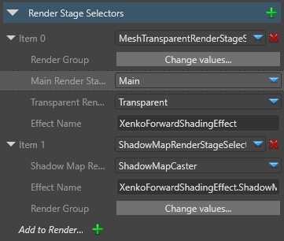

# Graphics compositor overview

 

With the graphics compositor, you can:

- render one or multiple scenes
  - using one or multiple cameras 
  - by filtering entities in the scene
  - to one or multiple render targets with a different viewports
- render a child scene (another "game part" or "scene layer") within another scene
- render a scene with a camera to a render target used as the input texture of a material/effect in a scene (eg render the rear-view mirror point of view to a texture and display it on the mirror)
- easily mix rendering modes at the same time in the same graphics composition
- easily mix HDR and LDR rendering
- apply image/post-processing effects on a render target, selected before/after the rendering of a camera
- easily clear a render target or clear only the depth buffer (eg to always render on top of a render target in a FPS game, or to render the UI)
- manipulate the compositor from scripts (or any animation system) in the scene to modify the composition, enable effects, etc

The graphics compositor is accessible by clicking on the scene root object and the properties of the graphics compositor will appear in the property editor.

 

> [!Note]
> You can currently only edit the graphics compositor through the property editor. Future versions of Game Studio will have a dedicated editor.

## Concepts

The graphics compositor is a pluggable system, so you can write your own compositor. It currently comes with a default **compositor by layers**.

 

Graphics composition by layers is similar to the concept of layers in image editing applications. It's based on the following concepts:

- camera slots
- renderFrame
- layers
- renderers

### Camera slots

Because you can set up a camera in different renderers and different layers, it's more practical to define a set of cameras at the scene graphics compositor level, and reference the camera in the renderers via a slot.

It allows to change/set the actual camera for a particular slot just once at the graphics compositor level, while many renderers may reference the same camera slot.

### RenderFrame

A Render Frame defines:

- the output texture/render target to receive the final color
- an optional depth stencil buffer that will be used for rendering.
- If the rendering frame is HDR or LDR
- How the size is computed based on the main window size (relative or absolute)

A default render frame is always created for the output window and is setup by default for the top root scene graphics compositor.

### Layers

A layer contains:

- A **render frame output**
- An **implicit render frame input** bound to the output of the previous layer
- A **list of renderers**

The graphics compositor is defined by:

- A list of variable layers
- A fixed layer called the **Master** **Layer**.
- Each layers are rendered in the order they are defined.
- The output of the Master layer is always bound to the default output of scene graphics compositor and cannot be changed (See advanced composition for more details)

### Renderers

A renderer defines a specific rendering action. Several renderers are provided by default:

- [Clear RenderFrame](scene-renderers/clear-renderframe.md)
- [Render Camera](scene-renderers/render-camera.md)
- [Render Effect](scene-renderers/render-effect.md)
- [Render Child Scene](scene-renderers/render-child-scene.md)