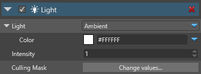

# Ambient lights

Beginner
Designer
Artist

**Ambient lights** are uniform lights that illuminate the entire scene. Because they don't come from any specific direction or source, ambient lights illuminate everything equally, even objects in shadow or obscured by other objects. They don't cast shadows. 

Ambient lights aren't realistic light sources. Instead, they contribute to the overall brightness and aesthetic of a scene.

 

An example of an object lit uniformly with ambient lighting (with a pure diffuse material):

## Properties

 

| Property     | Description                                                               
| ------------ | --------------------
| Color        | The color of the light (RGB)
| Intensity    | The intensity of the light. The color is multiplied by this value before being sent to the shader. Note: negative values produce darkness and have unpredictable effects
| Culling Mask | Which entity groups are affected by the light. By default, all groups are affected

## See also

* [Add a light](add-a-light.md)
* [Point lights](point-lights.md)
* [Directional lights](directional-lights.md)
* [Skybox lights](skybox-lights.md)
* [Spot lights](spot-lights.md)
* [Light probes](light-probes.md)
* [Shadows](shadows.md)