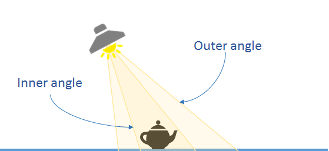

# Spot lights

A **spot light** produces a cone of light positioned in space oriented to a specific direction.

 

Game Studio represents the spot light with the following icon:

 

Once selected, the gizmo of the spot light displays its main direction, range and the outer cone:

 

## Properties

 

| Property            | Description      |
| ------------------- | ------- |
| Color               | The color of the light. Currently, the light supports an RGB color. Future versions of Xenko will also support temperature colors       
| Range               | The range in meters. Beyond the this range, the light doesn't affect models                                                                               |
| Angle Inner         | The inner angle of the spot cone where the light intensity influence is at one                                                                                        |
| Angle Outer         | The outer angle of the spot cone where the light intensity influence is zero                                                                                          |
| Shadows             |  **Filter**: Produces soft shadows instead of hard shadows. Currently, the implemented technique is PCF (Percentage Closer Filtering). More techniques will be added in future versions   **Size**: The size of the shadow map texture. Values are **extra large**, **large**, **medium**, **small** and **extra small**. See [Shadow optimization](shadow-optimization.md) for details   For spot lights, the default value is **medium**, as a spot light has usually a medium visual impact   
| Bias Parameters     |  These parameters are used to avoid some artifacts of the shadow map technique   **Depth Bias:** The amount of depth to add to the sampling depth to avoid shadow acne    **Normal Offset Scale**: A factor multiplied by the depth bias toward the normal  |
| Intensity           | The intensity of the light. The color is basically by this value before being sent to the shader. Currently, this value has no units. This will change in future versions   | 
Culling Mask        | Defines which entity groups are affected by this light. By default, all groups are affected.   |

## See also

* [Shadow optimization](shadow-optimization.md)