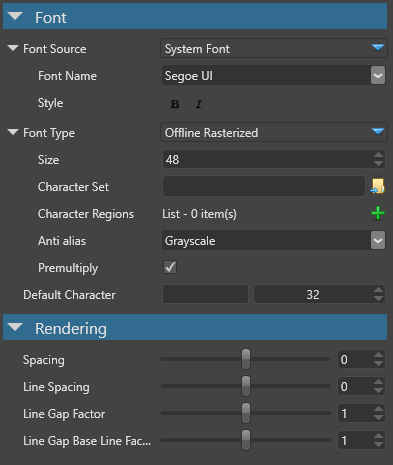
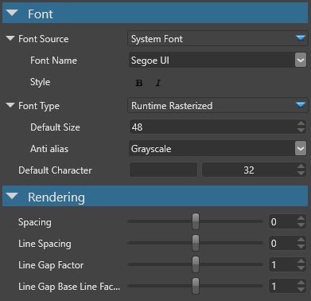
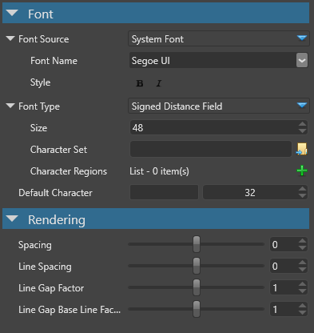
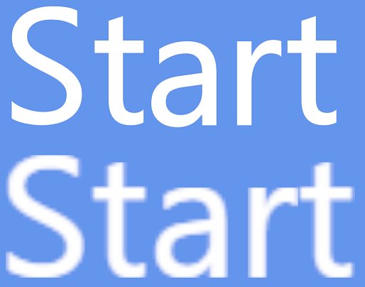
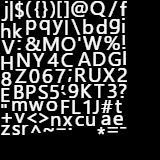
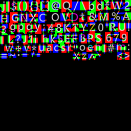
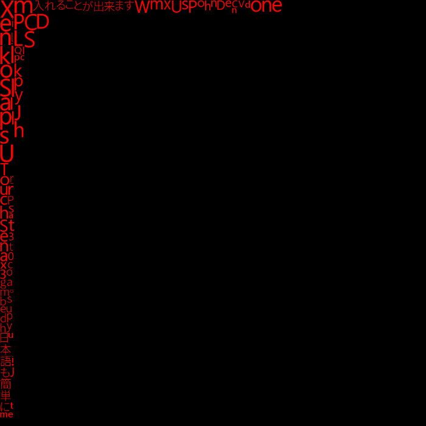

# Sprite Fonts

Intermediate

In games it is often inefficient to render fonts directly and we usually want to only rasterize them once and then only render the image of a character every time we need it.

Such a technique involves creating a sprite (billboarded rectangular image) of a character which is displayed on the screen as a regular image, 
and a text block would be a collection of sprites rendered as quads so that all the characters are aligned and spaced properly.

A sprite font is a game asset which take a TrueType font as an input (either a system font or you can assign it your own file) and then creates all the images (sprites) of characters (glyphs) which you might need in your game.

## Offline Rasterized Sprite Fonts

Offline-rasterized sprite fonts will create (rasterize) a fixed number of characters (glyphs) of certain size and bake them into an atlas texture when *building the assets* for your game.

In the game, they can only be drawn with this size and only the characters which were specified can be displayed.

Use offline-rasterized fonts when:

- You use a font of known size with a known character set in your game

- You require anti-aliasing on your fonts

- Your UI is only used in Fullscreen mode

Do **not** use offline-rasterized fonts when:

- Your UI is rendered as part of the 3D world scene

- You have a varied or uknown number of font sizes and character sets

 

| Property                    | Description                                                                                             |
|-----------------------------|---------------------------------------------------------------------------------------------------------|
| Font Source                 | System (installed on this machine) or from file. The system fonts can also choose **Bold** and *Italic* options.      |
| Font Type                   | Offline Rasterized                                                                                      |
|                             |                                                                                                         |
| Size (in pixels)            | The font will be baked with this size and no other font size can be displayed.                          |
| Character set               | (Optional) A text file containing all characters which need to be baked.                                |
| Character regions           | Code for regions of characters which need to be baked. For example (32 - 127) is a region sufficient for ASCII character sets. |
| Anti alias                  | None, Grayscale or ClearType ([link](http://alienryderflex.com/sub_pixel/)).                            |
| Premultiply                 | If the alpha should be premultiplied. Default is yes to match the rest of the engine pipeline.          |
| Default character           | Missing characters will default to this one when rendered. The default code is 32 which is space.       |

## Runtime Rasterized Sprite Fonts

Runtime-rasterized sprite fonts will create (rasterize) a varied number of characters (glyphs) of any size and bake them into an atlas texture *on demand*.

This function will be invoked in runtime any time you change the font size or request new characters, which haven't been drawn before.

Under the hood, the runtime-rasterized fonts use similar atlas textures to the offline-rasterized fonts so if you have 3 different font sizes, they will take about 3 times more memory as a single font size. The font sizes are also taken into account.

Use runtime-rasterized fonts when:

- You require multiple sizes for your font or don't know which characters you might be needing

- The number of possible characters in the font greatly outnumbers the number of characters you actually have to display at runtime (in case of some East Asian languages for example)

- You require anti-aliasing on your fonts

- Your UI is only used in Fullscreen mode

Do **not** use runtime-rasterized fonts when:

- Your UI is rendered as part of the 3D world scene

- You only require one or two known sizes for a small character set

- You have a scaling text! (it will recreate every single font size!)

 

| Property                    | Description                                                                                             |
|-----------------------------|---------------------------------------------------------------------------------------------------------|
| Font Source                 | System (installed on this machine) or from file. The system fonts can also choose **Bold** and *Italic* options.      |
| Font Type                   | Runtime Rasterized                                                                                      |
|                             |                                                                                                         |
| Default Size (in pixels)    | If size is not specified the text will be rendered with this one.                                       |
| Anti alias                  | None, Grayscale or ClearType ([link](http://alienryderflex.com/sub_pixel/)).                            |
| Default character           | Missing characters will default to this one when rendered. The default code is 32 which is space.       |

## Signed Distance Field Sprite Fonts

The Signed Distance Field (SDF for short) fonts rely on an entirely different technique to render the fonts. Rather than rasterizing the color of the character on the sprite, they output the distance of the current pixel to the closest edge of the glyph.

The distance is positive if the pixel is *inside* the glyph boundaries, or negative if the pixel is *outside* the glyph, hence the name - signed. When rendering one should just check the distance and output a white pixel if it's positive or 0, and a black pixel if it's negative.

This allows very sharp and clean edges to be rendered even under huge magnification of the character, something not possible with traditional sprites which will just look pixelated.

Long [paper](file:///C:/Users/alexander.radkov/Downloads/F8-DP-2015-Chlumsky-Viktor-thesis.pdf) on how distance fields and multi-channel distance fields in particular work.

[Thread](https://computergraphics.stackexchange.com/questions/306/sharp-corners-with-signed-distance-fields-fonts) on StackExchange outlining the differences between single-channel SDF and multi-channel SDF fonts.

Use SDF fonts when:

- Your UI is rendered as part of the 3D world scene or Fullscreen - it works well for both cases

- You have a scaling text or expect the user to be able to zoom in.

- You require multiple sizes for your font

- You have very big font sizes (will consume less memory than runtime-rasterized fonts)

Do **not** use SDF fonts when:

- You require anti-aliasing on your fonts (SDF fonts currently don't support it)

- You only require one or two known sizes for a small character set - better use offline-rasterized font

- The number of possible characters in the font greatly outnumbers the number of characters you actually have to display at runtime (in case of some East Asian languages for example) - if using runtime-rasterized font is not an option (because of scaling, etc.), be sure to bake every character you might need, otherwise they won't be displayed

 

| Property                    | Description                                                                                             |
|-----------------------------|---------------------------------------------------------------------------------------------------------|
| Font Source                 | System (installed on this machine) or from file. The system fonts can also choose **Bold** and *Italic* options.      |
| Font Type                   | Offline Rasterized                                                                                      |
|                             |                                                                                                         |
| Size (in pixels)            | The font will be baked with this size. All font sizes can still be displayed. Bigger size usually results in better quality, and generally you want to keep this at 20 or more to avoid visual glitches.     |
| Character set               | (Optional) A text file containing all characters which need to be baked.                                |
| Character regions           | Code for regions of characters which need to be baked. For example (32 - 127) is a region sufficient for ASCII character sets. |
| Default character           | Missing characters will default to this one when rendered. The default code is 32 which is space.       |

### Comparison

 

Comparison between the SDF fonts and the offline-rasterized fonts under magnification.

## Under the hood

Lets take a look at what the texture atlasses look like for the different sprite fonts.

### Offline rasterized

 

The offline rasterized sprite font bakes all requested characters once in a grayscale texture. If you zoom in you will see that they are pixelated. It has a fixed size and doesn't work well for scaling text.

### Signed Distance Field

 

The Signed Distance Field sprite font also bakes all requested characters once. The major difference is that it encodes distances from the character lines rather than actual color and it uses all three channels RGB. You can still recognize each character, but we need a special shader to render them properly. The upside is that the edges remain clean and sharp even under a huge magnification.

### Runtime rasterized

 

The runtime-rasterized sprite font only bakes (rasterizes) the characters which are actually drawn in the game. The initial atlas texture is intentionally bigger so that it can hold more characters of possibly different sizes before it needs to be resized.

