# Tutorial: Script a trigger

<span class="label label-doc-level">Beginner</span>
<span class="label label-doc-audience">Designer</span>

In this tutorial, we'll create a [trigger](../physics/triggers.md) that doubles the size of a ball when the ball passes through it.

## 1. Create a bouncing ball

Follow the instructions in the [Create a bouncing ball](create-a-bouncing-ball.md) tutorial. This creates a simple scene in which a ball falls from mid-air, hits the ground, and bounces.

## 2. Set the restitution

For this tutorial, we'll set the restitution of both the ground and the sphere to 0.9, which makes the ball very bouncy. This makes it easier to see the effect of the trigger later, as the ball will bounce in and out of the trigger area repeatedly.

1. Select the **Sphere** entity.

2. In the **Property grid**, under **Rigidbody**, set the **Restitution** to *0.9*.

    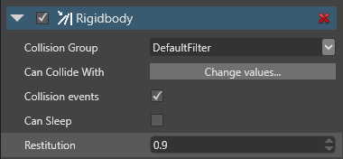

3. Select the **Ground** entity.

4. In the **Property grid**, under **Static Collider**, set the **Restitution** to *0.9*.

    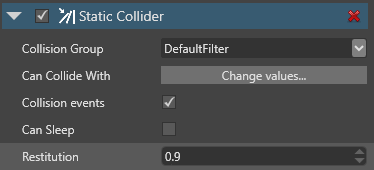

## 3. Add a trigger 

Now we'll add a trigger between the ball and the ground, so the ball passes through it.

1. In the **Scene editor**, click the white plus sign (**Create new entity**) and select **Empty entity**.

    

    Game Studio adds an entity to the scene with the default name **Entity**.

2. This entity will be our trigger, so rename it *Trigger* to make it easy to identify.

3. Since we don't need the trigger to move, we'll make it a static collider. In the **Property grid**, click **Add component** and select **Static Collider**.

    

4. In the **Property grid**, expand the **Static Collider component** to view its properties.

5. Select the **Is Trigger** checkbox.

    

    This makes the collider a trigger. This means objects can pass through it, but are still detected in the code.

6. We need to give the trigger a shape. Next to **Collider Shapes**, click the **green plus icon** and select **Box**.

    

    This gives the trigger a box shape.

    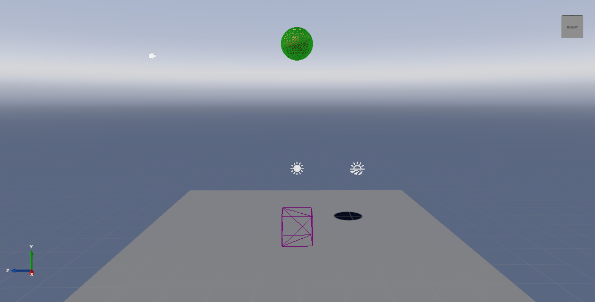

7. Let's make the trigger a larger area. In the **Property grid**, under the **Transform** component properties, set the **scale** to: *X:2, Y:2, Z:2*

    

    This doubles the size of the trigger.

    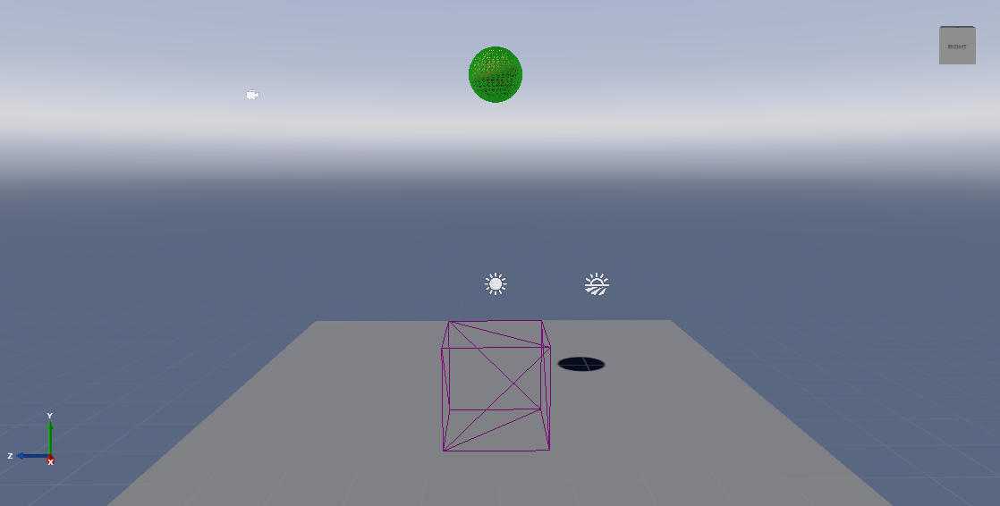

## 4. Give the trigger a model

Right now, the trigger is invisible at runtime. To better show how the trigger works, we'll make it a transparent box. This has no effect on how the trigger works; it just means we can easily see where it is at runtime.

1. Create a new procedural model asset. To do this, in the **Asset view**, click **Add asset**, and select **Models > Cube**.

    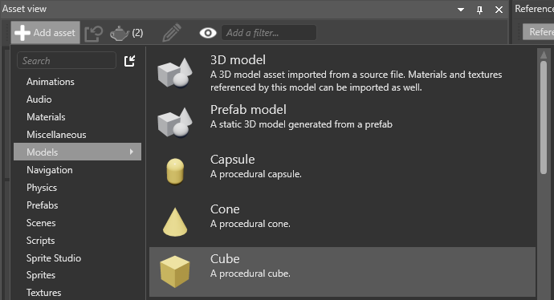

2. Create a new empty material asset. To do this, in the **Asset view**, click **Add asset**, and select **Materials > Material**.

    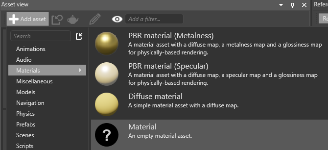

3. Let's rename the material to make it easy to identify. To do this, right-click, select **Rename**, and type a new name (eg *Transparent*).

4. Select the **Trigger** entity. In the **Property grid**, click **Add component** and select **Model**.

    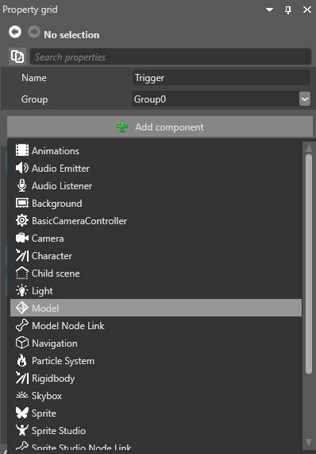

    Game Studio adds a model component to the entity.

5. Under **Model**, click the hand icon (**Pick asset up**) to open the **Asset picker**.

    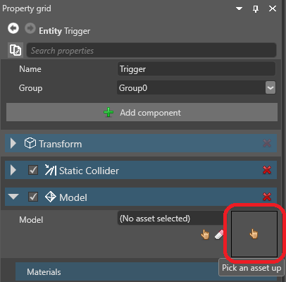

6. Select the **Cube** model we created in step 1 and click **OK**.

    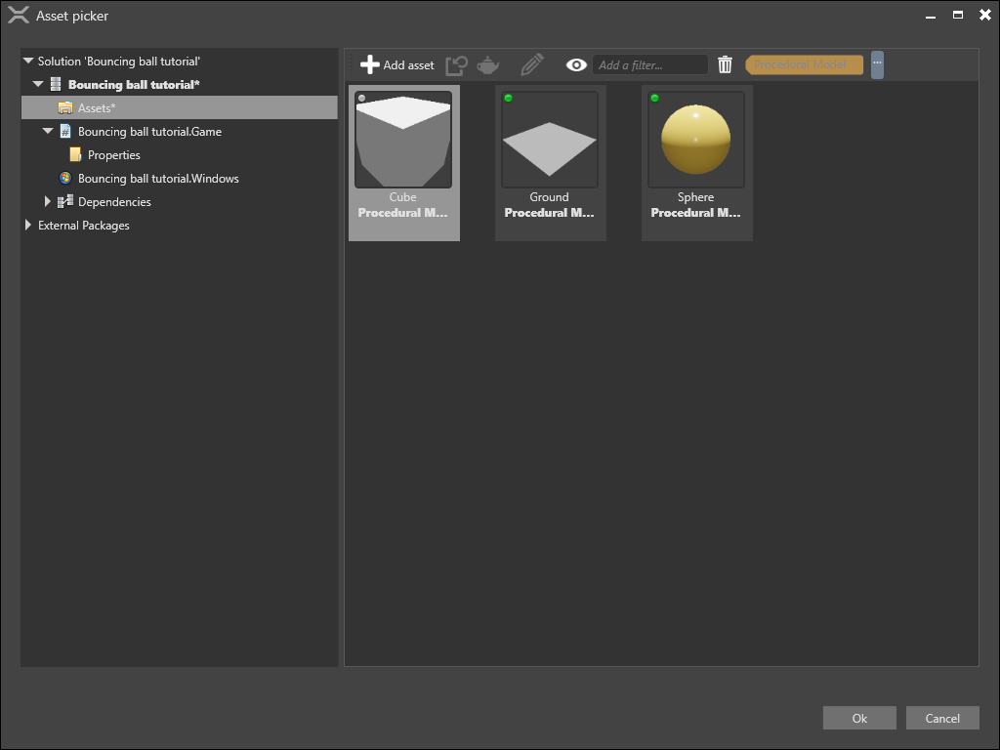

7. In the **Property grid**, under **Model > Materials**, click the hand icon (**Pick asset up**) to open the **Asset picker**.

    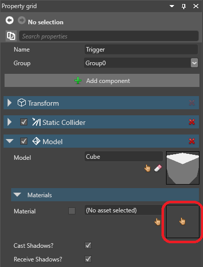

8. Select the **Transparent** material we created in step 2 and click **OK**.

    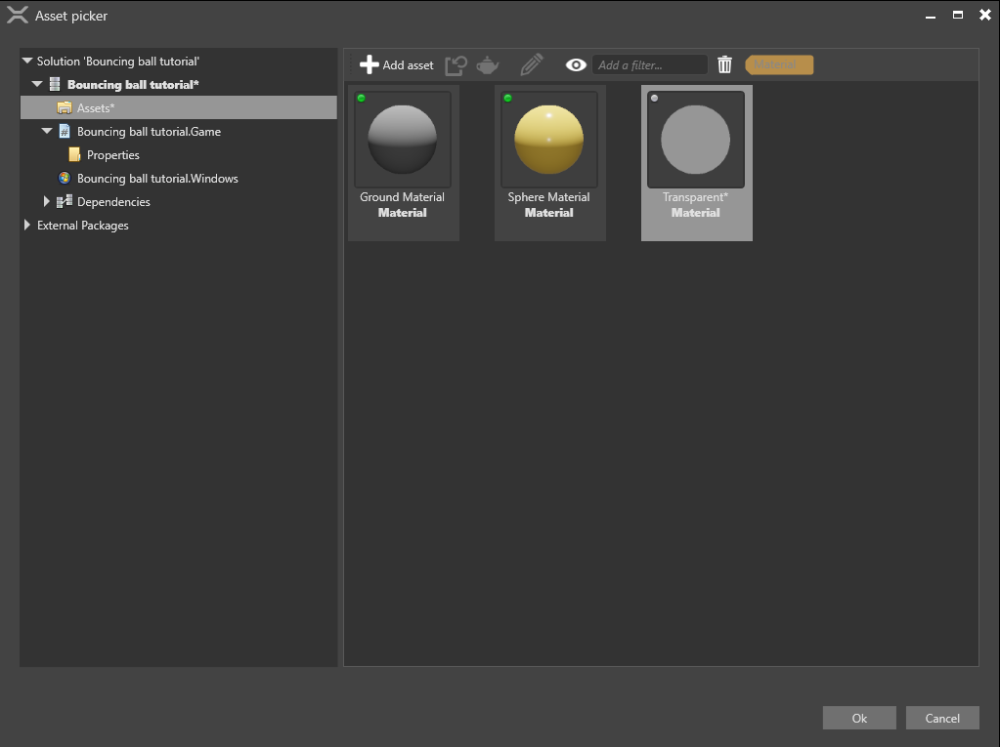

9. In the **Asset view**, select the **Transparent** material asset.

    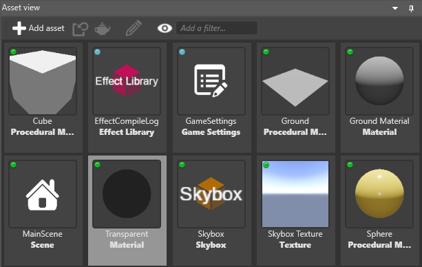

10. In the **Property grid**, under **Misc > Transparency**, select **Blend**.

    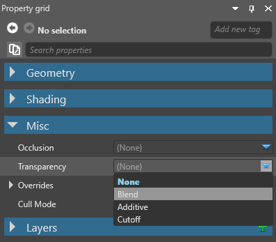

11. By default, the Alpha is set to 1. This makes the material completely opaque. To set it to 50% opacity, set the **Alpha** to 0.5.

    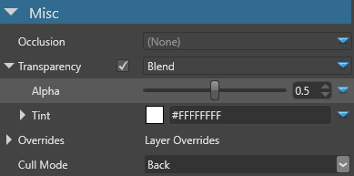

    Now the trigger area will be visible at runtime.

## 5. Position the trigger 

We need to position the trigger between the ground and the sphere, so the ball falls through it.
    
In the **Property grid**, under **Transform**, set the **Position** to: *X:0, Y:3, Z:0*

Now the trigger entity is between the ground and the sphere:

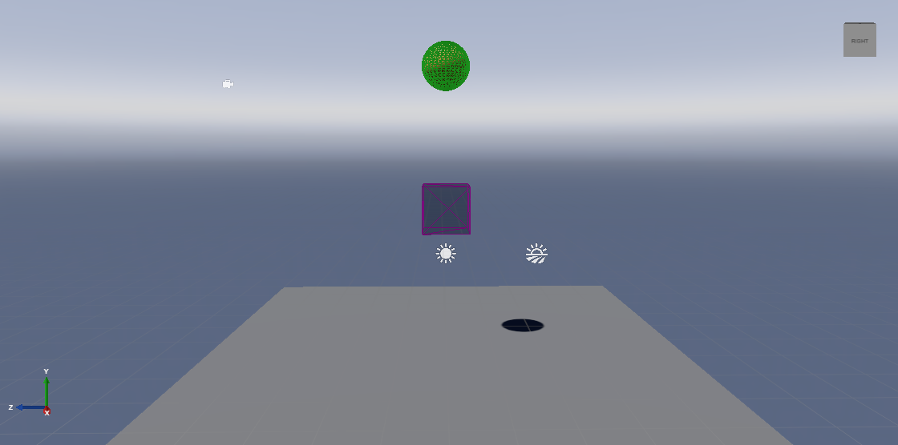

## 6. Change the sphere size with script

If we run the project now (**F5**), the ball falls through the trigger, but nothing happens.

<p>
<video autoplay loop class="responsive-video" poster="media/bouncing-ball-with-trigger-no-effect.png">
   <source src="media/bouncing-ball-with-trigger-no-effect.mp4" type="video/mp4">
</video>
</p>

Let's write a script to change the size of the ball when it enters the trigger.

>[!Note]
>For more information about scripts, see [Scripts](../scripts/index.md).

1. In the **Asset view**, click **Add asset** and select **Scripts** > **Async Script**.

    

2. In the **Script wizard** dialog, name your script *Trigger* and click **OK**.

    2a. If Game Studio asks if you want to save your script, click **Yes**.
    
    2b. If Game Studio asks if you want to reload the assemblies, click **Yes**.

3. Open the script, replace its content with the following code, and save the file:

    ```
    using SiliconStudio.Xenko.Engine;
    using SiliconStudio.Xenko.Physics;
    using System.Threading.Tasks;
    using SiliconStudio.Core.Mathematics;

    namespace TransformTrigger
    // You can use any namespace you like for this script.
    {
        public class Trigger : AsyncScript
        {
            public override async Task Execute()
            {
                var trigger = Entity.Get<PhysicsComponent>();
                trigger.ProcessCollisions = true;

                // Start state machine
                while (Game.IsRunning)
                {
                    // 1. Wait for an entity to collide with the trigger
                    var firstCollision = await trigger.NewCollision();

                    var otherCollider = trigger == firstCollision.ColliderA
                        ? firstCollision.ColliderB
                        : firstCollision.ColliderA;
                    otherCollider.Entity.Transform.Scale = new Vector3(2.0f, 2.0f, 2.0f);

                    // 2. Wait for the entity to exit the trigger
                    Collision collision;

                    do
                    {
                        collision = await trigger.CollisionEnded();
                    }
                    while (collision != firstCollision);

                    otherCollider.Entity.Transform.Scale= new Vector3(1.0f, 1.0f, 1.0f);
                }
            }
        }
    }
    ```

    This code doubles the size (scale) of any entity that enters the trigger. When the entity exits the trigger, it returns to its original size.

4. Reload the assemblies.

## 7. Add the script

Finally, let's add this script to the trigger entity as a component.

1. In **Game Studio**, select the **Trigger** entity.

2. In the **Property grid**, click **Add component** and select the **Trigger** script.

    

## 8. Run the project

Run the project (**F5**) to see the trigger in action.

The ball falls through the trigger, doubles in size, exits the trigger, and returns to its normal size.

<p>
<video autoplay loop class="responsive-video" poster="media/bouncing-ball-with-trigger-scaled_first_frame.png">
   <source src="media/bouncing-ball-with-trigger-scaled.mp4" type="video/mp4">
</video>
</p>

## More ideas

You can alter the script to make other changes when the sphere enters the trigger. 

For example, you can switch the material on the sphere entity. This script switches the material on the Sphere entity from the **Sphere Material** to the **Ground Material** and back again:

```
using SiliconStudio.Xenko.Engine;
using SiliconStudio.Xenko.Physics;
using System.Threading.Tasks;
using SiliconStudio.Core.Mathematics;
using SiliconStudio.Xenko.Rendering;

namespace TransformTrigger
// You can use any namespace you like for this script.
{
    public class Trigger : AsyncScript
    {
        private Material material1;
        private Material material2;
    
        public override async Task Execute()
        {
            var trigger = Entity.Get<PhysicsComponent>();
            trigger.ProcessCollisions = true;
            
            // Make sure the materials are loaded 
            material1 = Content.Load<Material>("Sphere Material");
            material2 = Content.Load<Material>("Ground Material");

            // Start state machine
            while (Game.IsRunning)
            {
                // 1. Wait for an entity to collide with the trigger
                var firstCollision = await trigger.NewCollision();

                var otherCollider = trigger == firstCollision.ColliderA ? firstCollision.ColliderB : firstCollision.ColliderA;
                    
                // 2. Change the material on the entity
                otherCollider.Entity.Get<ModelComponent>().Materials[0] = material2;
                
                // 3. Wait for the entity to exit the trigger
                Collision collision;

                do
                {
                    collision = await trigger.CollisionEnded();
                }
                while (collision != firstCollision);

                // 4. Change the material back to the original one
                otherCollider.Entity.Get<ModelComponent>().Materials[0] = material1;
            }
        }
        
        public override void Cancel()
        {
            Content.Unload(material1);
            Content.Unload(material2);
        }
    }
}
```

<p>
<video autoplay loop class="responsive-video" poster="media/bouncing-ball-with-trigger-material_first_frame.png">
   <source src="media/bouncing-ball-with-trigger-material.mp4" type="video/mp4">
</video>
</p>

## See also

* [Tutorial: Create a bouncing ball](create-a-bouncing-ball.md)
* [Colliders](colliders.md)
* [Collider shapes](collider-shapes.md)
* [Scripts](../scripts/index.md)