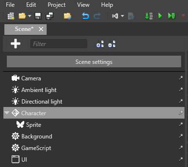
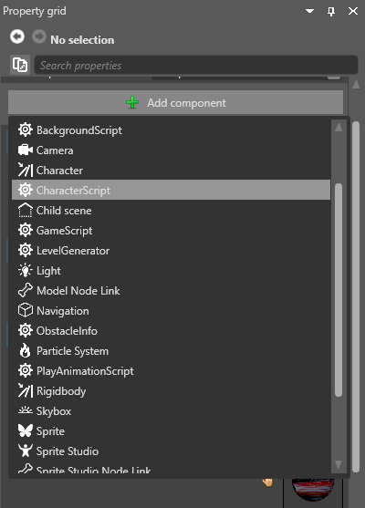

# Add a script

<span class="label label-doc-level">Beginner</span>
<span class="label label-doc-audience">Programmer</span>

Xenko runs scripts when the entity they are attached to is loaded in the scene. This page explains how to attach scripts to entities.

## Attach a script

To use scripts, attach them to entities as components. You can do this in Game Studio or in code.

You can attach a single script to as many entities as you need. You can also attach multiple scripts to single entities; in this case, Game Studio creates multiple **instances** of the script. This means the same script can have different values in its public properties.

### Attach a script in Game Studio

There are two ways to attach scripts in Game Studio: 

* dragging the script from the asset view to the entity properties
* adding the script in the property grid

They both have the same result.

#### Drag and drop

1. In the **entity tree** (on the left by default), or in the scene, select the entity you want to attach the script to.

2. In the **solution explorer** (in the bottom left by default), select the assembly which contains your script. Game Studio shows your script in the **asset view**.

    >[!Note]
    > Although scripts are a kind of asset, they're not saved in the Assets folder. This is because code assets usually aren't saved in the same folder as other kinds of asset. For more information, see [Project structure](../get-started/project-structure.md).

3. Drag the script from the **asset view** to the **property grid**.
   
   Game Studio attaches the script to the entity.

#### Add the script in the property grid

1. In the **entity tree** (on the left by default), or in the scene, select the entity you want to attach the script to.

    

2. In the **property grid** (on the right by default), click **Add component** and select the script you want to attach.

    

    Game Studio attaches the script to the entity.

### Attach a script from code

You can use code to instantiate and attach a script to an entity.

1. In Visual Studio, create a script and save it.

2. In another executed script, use the following code, where *myAsyncScript* is the script name and *myEntity* is the entity you want to attach it to:

    ```Code: 
    // myEntity being an existing entity in the scene
    myEntity.Add(new myAsyncScript());
    ```

## See also

* [Types of script](types-of-script.md)
* [Create a script](create-a-script.md)
* [Public properties and fields](public-properties-and-fields.md)
* [Scheduling and priorities](scheduling-and-priorities.md)
* [Debugging](debugging.md)