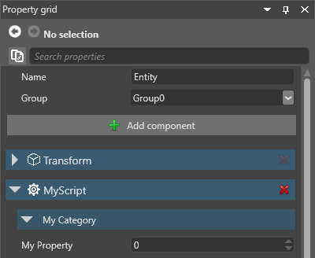

# Attributes

<span class="label label-doc-level">Beginner</span>
<span class="label label-doc-audience">Programmer</span>

Attributes change how users edit properties and values in the **property grid** in Game Studio. 

Add attributes above public classes you declare in your scripts. For example:

```cs
        [DataMember]
        [DataMemberRange(-10, 10, 0.1f, 1f)]
        [Display(category: "Simple Properties")]
        [DefaultValue(2.0f)]
        public float Float { get; set; } = 2.0f;
```

## DataMember


## DataMemberRange

[DataMemberRange](xref:SiliconStudio.Core.Annotations.DataMemberRangeAttribute) specifies the range of the value.

```cs
        [DataMember]
        [DataMemberRange(-10, 10, 1, 2)]
        public int Integer { get; set; }
```

* The first number specifies the minimum value. 
* The second number specifies the maximum value.
* The third number specifies the increments.
* **The fourth number is a mystery. Good luck!**

## DataMemberIgnore

[DataMemberIgnore](xref:SiliconStudio.Core.DataMemberIgnoreAttribute) hides the property in the property grid. 

```cs
	// This public property isn't available in Game Studio
	[DataMemberIgnore]
	public float DelayTimeOut { get; set; }
```	

Game Studio no longer shows the property in the property grid:

![Public property been hidden with ```[DataMemberIgnore]```](media/scripts-in-xenko-public-property-with-datamemberignore.png)

## DefaultValue

Sets a default value for the property.

>![Note]
>You need to specify this in both the ``DefaultValue`` attribute and after the class  declaration.

```cs
        [DefaultValue(2.0f)]
        public float Float { get; set; } = 2.0f;
```

## Display

[Class DisplayAttribute](xref:SiliconStudio.Core.DisplayAttribute.html) changes the property label in the property grid.

```cs
        [Display("My Property")]
        public double Double { get; set; }
```


You can also specify an expandable category for the property to be displayed under.

```cs
        [Display("My Property", "My Category")]
        public double Double { get; set; }
```



If you want to include the property in a category without giving it a name, use ``[Display(category: "My Category")]``. For example:

```cs
        [Display(category: "My Category")]
        public double Double { get; set; }
```

## CategoryOrder

By default, the property grid lists properties in the same order they appear in your script. You can specify a different order using [CategoryOrder](xref:SiliconStudio.Core.Annotations.CategoryOrderAttribute). Categories with lower numbers are displayed first. You can also use negative numbers.

```cs
    [CategoryOrder(1, "Lists")]
    [CategoryOrder(2, "Readonly Lists")]
    [CategoryOrder(3, "Simple Properties")]
    public class MyScript : StartupScript
```


If two categories have the same number, Game Studio displays them in alphabetical order. 

## MemberCollectionAttribute

