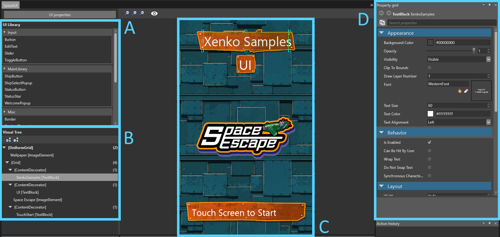
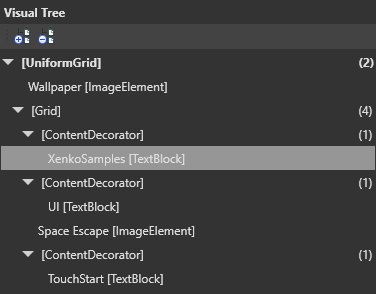
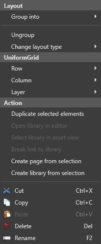
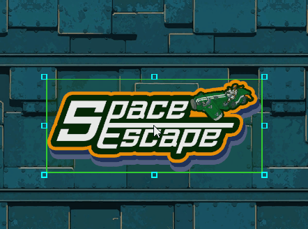
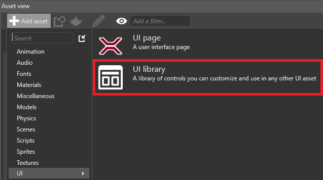
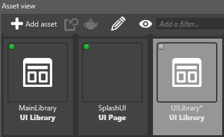

# UI editor

The **UI editor** 

## UI assets and runtime counterparts

There are two type of UI asset: `UIPageAsset` and `UILibraryAsset`. Their runtime counterparts are `UIPage` and `UILibrary` respectively.

### UI page

A UI page is a tree of UI elements. It contains the root UI elements and all its children.

You can assign a UI page to the `Page` property of a UI component.

```cs
// This property can be assigned from a UI page asset in Game Studio
public UIPage MyPage { get; set; }

protected override void LoadScene()
{
    InitializeUI();
}

public void InitializeUI()
{
    var rootElement = MyPage.RootElement;
    // to look for a specific element in the UI page, extensions methods can be used
    var button = rootElement.FindVisualChildOfType<Button>("buttonOk");

    // if there is no element named "buttonOk" in the UI tree or the type does not match,
    // the previous method will return null
    if (button != null)
    {
        // attach a delegate to the Click event
        button.Click += delegate
        {
            // do something here...
        };
    }

    // assign the page to the UI component
    var uiComponent = Entity.Get<UIComponent>();
    uiComponent.Page = MyPage;
}
```

### UI libraries

UI libraries are similar to [prefabs](../game-studio/prefabs.md). They have several root elements that you can export and reuse in UI pages or other UI libraries. At runtime, you can reinstantiate UI library roots and insert them into an existing UI tree.

```cs
// This property can be assigned from a UI library asset in Game Studio
public UILibrary MyLibrary { get; set; }

public Button CreateButton()
{
    // assuming there is a root element named "MyButton" of type (or derived from) Button
    var button = MyLibrary.InstantiateElement<Button>("MyButton");

    // if there is no root named "MyButton" in the library or the type does not match,
    // the previous method will return null
    if (button != null)
    {        
        // attach a delegate to the Click event
        someButton.Click += delegate
        {
            // do something here...
        };
    }

    return button;
}
```

## Use the editor



The editor is composed of:

* a list of available UI libraries
* the visual tree of UI elements
* a rendered view of the UI
* the property grid to edit the UI element properties

### UI asset properties


You can change the resolution used at design time in the UI asset properties (for both UI pages and UI libraries). This is the equivalent of the UI component `Resolution` property.

To edit the value, click the **UI properties** button in the UI editor, or select the UI asset in the asset view.

### UI libraries

All the libraries that exists in the current project appear in the list. 

Note: there is always at least the standard library of all existing UI elements.

### Visual tree

The **visual tree** represents the hierarchy of UI elements in the asset.

UI pages have only one root element. UI libraries can have multiple root elements.



When an element has child elements, the number of children is indicated between parentheses on the right.

To expand and collapse the element, click the arrow.

To expand or collapse the entire tree, use the two buttons in the above toolbar.

You can drag and drop elements inside the visual tree to re-order them. 

Some elements can have several children (eg Panel such as Grid). Others can only have one child (eg Buttons).

#### Context menu



When right-clicking on an element in the visual tree, a context menu will appear and offer several options.

Depending on the type of the selected element and also on the type of its parent, some options will or will not be
available.

* Layout category
  * *Group into*: the selected element(s) will be replaced by a panel (which type is selectable in a sub-menu) and
    added as children of this new panel.
  * *Ungroup*: all children of the selected panel will be move to its parent
  * *Change layout type*: the selected panel type will be change to another panel type (e.g. from a Grid to a 
    UniformGrid)
* Panel specific category (in case of the screenshot above, it is a UniformGrid)
  * Depending on the parent panel type, it will offer different options, such as moving the element to a different
    column
* Action category
  * *Rename*: to change the name of the selected element
  * *Delete selection*: remove the selected elements from the visual tree
  * *Duplicate selection*: will copy the selected element and all its sub-tree into a new sibling element (i.e.
    added as child of the same parent)
  * *Create page from selection*: create a new page asset containing a copy of the selected element (single
    selection)
  * *Create library from selection*: create a new library asset containing a copy of all selected elements (single
    or multi selection)

### UI view

The UI view shows a preview of the UI as it appears at runtime. The rendering is equivalent to the rendering in the game, assuming the design resolution is the same as the UI component that uses the edited asset (see [UI Asset properties](#ui-asset-properties)).

The UI view camera is orthographic (see [Cameras](../graphics/cameras.md). The UI always faces the camera.

#### UI view controls

| Action            | Control                              
|-------------------|--------------------------------------
| Pan               | Hold middle mouse button + move mouse
| Zoom              | Mouse wheel                          
| Speed up pan/zoom | Hold shift while panning or zooming  


The view toolbar offer options such as zooming in and out, resetting the view. Also changing the color of the
tools in the view (such as color of selection, sizing rectangle, etc.).

#### Manipulate elements

You can select, move, and resize elements as you do in image editing applications.





### Element properties

You can view and edit element properties in the property grid (on the right by default). Properties are sorted by **Appearance**, **Behavior**, **Layout** and **Misc**.


#### Appearance

This category contains the properties controlling the appearance of the UI element. Common properties include
`BackgroundColor`, `Opacity`, `Visibility`, `ClipToBounds`...


#### Behavior


This category contains the properties controlling the behavior of the element. Common properties include whether the
element will respond to touch events (`CanBeHitByUser`).

#### Layout


This category contains the properties controlling how the element is layed out. Common properties include the size
of the element (`Height`, `Width` and `Depth`), its alignment (`HorizontalAlignment`, `VerticalAlignment`,
`DepthAlignement`), `Margin`...

#### Misc

This category contains the `Name` property.


## Create a page

From the asset view toolbar, click on the **Add asset** button. In the drop-down menu, select the **UI**
category and click on **UI Page**. To open the newly created asset, either double-click on it, select it
and press CTRL+Enter, or click on the **Open this asset in editor** button from the property grid.

## Create a library

In the **asset view**, click **Add asset > UI > UI library**.



Game Studio adds the UI library to the asset view.

