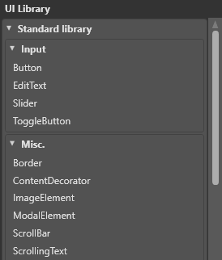
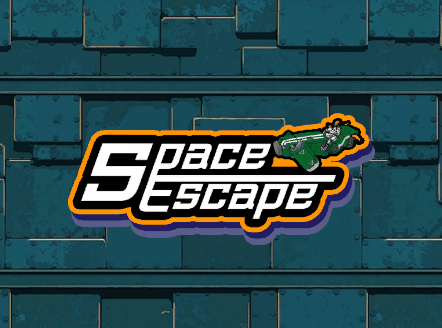
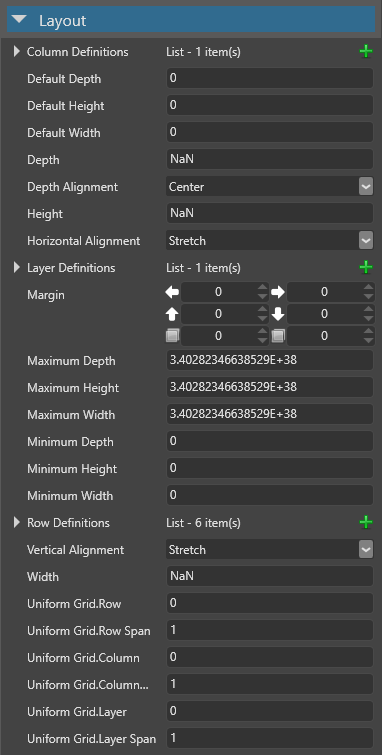
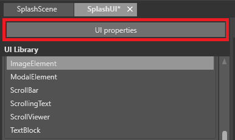

# UI editor

With the **UI editor**, you can create and edit UIs for your game.


The UI editor comprises:

* the list of UI libraries (**A**)

* a visual tree of elements in your UI (**B**)

* a preview of the UI as it appears in the game (**C**)

* a property grid to edit the properties of the elements in your UI (**D**)

There are two type of UI asset: `UIPageAsset` and `UILibraryAsset`. Their runtime counterparts are `UIPage` and `UILibrary` respectively.

## Open the UI editor

In the **asset view**, double-click a **UI page** or **UI library** to open it in the UI editor.


## UI libraries

A **UI library** contains **UI elements** (such as grids, buttons, sliders and so on) that you can use and re-use in your UI pages. 



UI libraries are similar to [prefabs](../game-studio/prefabs.md) in the scene editor; you can create your own elements, save them in a custom UI library, and then use them wherever you need across multiple UI pages.

At runtime, you can re-instantiate UI library roots and insert them into an existing UI tree.

All libraries include the **standard library**. All UI elements derive from the standard UI library.


All the libraries in the current project are in the list of UI libraries.

> [!Note]
> The standard library of UI elements is always in the list.


you need to name elements for them to be available in other ui

you can nest libraries


### Create a UI library

In the **asset view**, click **Add asset > UI > UI library**.


Game Studio adds the UI library to the asset view.


### Assign a UI library in code

```cs
// This property can be assigned from a UI library asset in Game Studio
public UILibrary MyLibrary { get; set; }

public Button CreateButton()
{
    // assuming there is a root element named "MyButton" of type (or derived from) Button
    var button = MyLibrary.InstantiateElement<Button>("MyButton");

    // if there is no root named "MyButton" in the library or the type does not match,
    // the previous method will return null
    if (button != null)
    {        
        // attach a delegate to the Click event
        someButton.Click += delegate
        {
            // do something here...
        };
    }

    return button;
}
```

UI pages have only one root element. UI libraries can have multiple root elements.?????????????

## Visual tree

The **visual tree** shows the elements in the UI page and their hierarchy. This is similar to the **entity tree** in the scene editor.


To add an element to the page, drag it from the **UI library** to the UI page or the **visual tree**.

When an element has child elements, the number of children is indicated between parentheses on the right.

You can drag and drop elements inside the visual tree to re-order them. 

Some elements, such as panels, can have multiple children. Others, such as buttons, can only have one child.

### Context menu

To open the element context menu, right-click an element.


Depending on the type of the selected element and also on the type of its parent, some options will or will not be
available.

* Layout category

  * *Group into*: the selected element(s) will be replaced by a panel (which type is selectable in a sub-menu) and added as children of this new panel.

  * *Ungroup*: all children of the selected panel will be move to its parent

  * *Change layout type*: the selected panel type will be change to another panel type (e.g. from a Grid to a UniformGrid)

* Panel specific category (in case of the screenshot above, it is a UniformGrid)

  * Depending on the parent panel type, it will offer different options, such as moving the element to a different column

* Action category

  * *Rename*: to change the name of the selected element

  * *Delete selection*: remove the selected elements from the visual tree

  * *Duplicate selection*: will copy the selected element and all its sub-tree into a new sibling element (ie added as child of the same parent)

  * *Create page from selection*: create a new page asset containing a copy of the selected element (single selection)

  * *Create library from selection*: create a new library asset containing a copy of all selected elements (single or multi selection)

## UI preview

The **UI preview** displays a preview of the UI as it appears at runtime. The rendering is equivalent to the rendering in the game, assuming the design resolution is the same as the UI component that uses the edited asset (see [UI Asset properties](#ui-asset-properties)).

The UI view camera is orthographic (see [Cameras](../graphics/cameras.md). By default, the UI always faces the camera.

You can select, move, and resize elements in the preview as you do in image editing applications.




### Controls

| Action            | Control                              
|-------------------|--------------------------------------
| Pan               | Hold middle mouse button + move mouse
| Zoom              | Mouse wheel                          
| Speed up pan/zoom | Hold shift while panning or zooming  

### Zoom

To zoom in and out of the UI preview, use the **mouse wheel** or the zoom icons: 

### UI selection tool options

You can change the color and size of the UI selection tools. To do this, in the **UI editor toolbar**, click 


* The **Selection** value changes the width of the selection highlight.

* The **Sizing** value changes the size of the boxes...

> [!Note]
> These options have no effect on how the UI is displayed at runtime.

## Properties

You can view and edit element properties in the **property grid** (on the right by default). Properties are sorted by **Appearance**, **Behavior**, **Layout** and **Misc**.


### Appearance

Common properties include `BackgroundColor`, `Opacity`, `Visibility` and `ClipToBounds`.


### Behavior


Commonly used properties include whether the element responds to touch events (`CanBeHitByUser`).

### Layout



Commonly used properties include the size of the element (`Height`, `Width` and `Depth`), its alignment (`HorizontalAlignment`, `VerticalAlignment`,
`DepthAlignement`) and its `Margin`.

### Misc


This category contains only the `Name` property.

## UI pages

A **UI page** is a collection of UI elements. A UI page is equivalent to a scene, and UI elements to entities in a scene. Elements can have parents and children, just like entities. Each UI scene opens in its own tab.

### UI asset properties


You can change the resolution used at design time in the UI asset properties (for both UI pages and UI libraries). This is the equivalent of the UI component `Resolution` property.

To edit the value, click the **UI properties** button in the UI editor. 



Alternatively, select the UI asset in the **asset view**.


