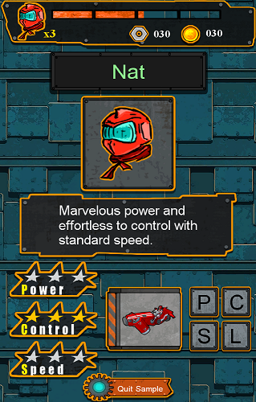

# UI

Xenko contains a complete UI system to build visually impressive in-game UI interfaces.

It is built upon a simplified design of Windows Presentation Foundation (WPF) so that people can get quickly up to speed

Xenko features a UI system that lets you build impressive user interfaces. It uses a simplified version of Windows Presentation Foundation (WPF), with many of the same components and containers. For more information about WPF, see the [MSDN documentation](https://msdn.microsoft.com/en-us/library/ms745058(v=vs.110).aspx). It supports 2D and 3D independently of resolution.

## Controls

Xenko features many UI control components, including:

* @'SiliconStudio.Xenko.UI.Controls.ImageElement'
* @'SiliconStudio.Xenko.UI.Controls.ContentControl'
  * @'SiliconStudio.Xenko.UI.Controls.ScrollViewer'
  * @'SiliconStudio.Xenko.UI.Controls.Button'
    * @'SiliconStudio.Xenko.UI.Controls.ToggleButton'
  * @'SiliconStudio.Xenko.UI.Controls.ContentDecorator'
* @'SiliconStudio.Xenko.UI.Controls.TextBlock'
  * @'SiliconStudio.Xenko.UI.Controls.ScrollingText'
* @'SiliconStudio.Xenko.UI.Controls.EditText' (displays soft keyboard on mobile devices)
* @'SiliconStudio.Xenko.UI.Panels.Panel'
  * @'SiliconStudio.Xenko.UI.Panels.StackPanel' (supports virtualization)
  * @'SiliconStudio.Xenko.UI.Panels.Grid'
  * @'SiliconStudio.Xenko.UI.Panels.UniformGrid'
  * @'SiliconStudio.Xenko.UI.Panels.Canvas'
* @'SiliconStudio.Xenko.UI.Controls.ScrollBar'
* @'SiliconStudio.Xenko.UI.Controls.ModalElement'

You can also create your own.

## Performance

Drawing of multiple elements will be batched using a 3D Sprite batch renderer to reduce number of draw call. Objective is to keep CPU available for more important stuff.

## Sample project

For an example of an implemented UI, see the **game menu UI** sample included with Xenko.

